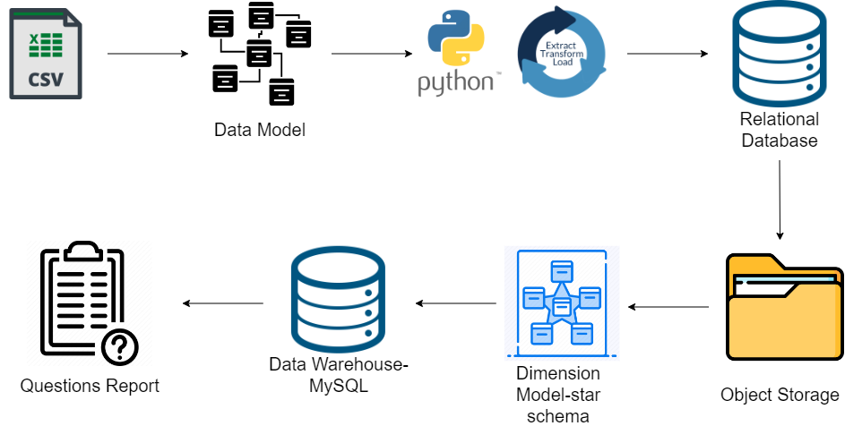
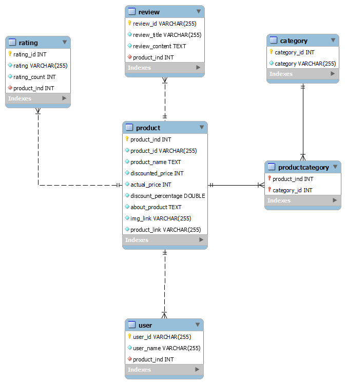
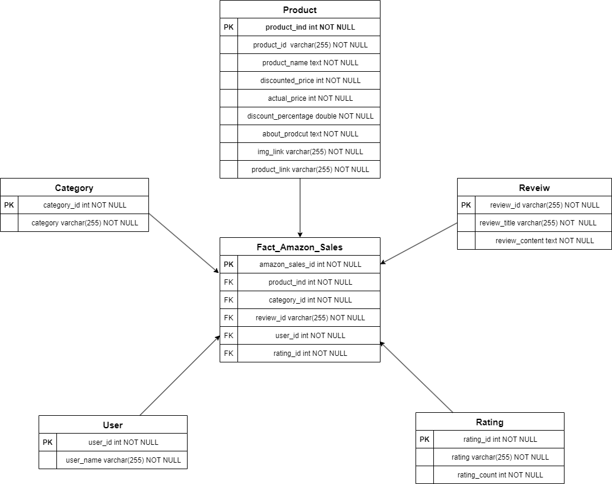

# MySQL ETL project

## Introduction

This project focuses on creating an end-to-end ETL pipeline, starting with dataset acquisition, data modeling, and storage in relational database and object storage. We develop a dimensional model, automate ETL jobs, set up a data warehouse(relational datbase), and conduct advanced data analysis. The goal is to enable data-driven decision-making through a structured and comprehensive ETL process.

This dataset amazon.csv is having the data of 1K+ Amazon Product's Ratings and Reviews as per their details listed on the official website of Amazon
https://www.kaggle.com/datasets/karkavelrajaj/amazon-sales-dataset

## Data Architecture Diagram

## Project Steps

**Step 1: Create Data Model**

Create a data model involves defining entities, attributes, relationships, and constraints, culminating in the creation of database tables. Normalize data, design an ERD, create tables, add constraints, and document thoroughly. Test, refine, and secure your model. Regular backups and version control are crucial for maintaining data integrity.

**Step 2: Data ETL**

Ensure data integrity through thorough cleaning, addressing missing values, and handling outliers. De-joining data when needed for efficient analysis. Convert data types, validate entries, and perform quality checks to establish a reliable dataset, crucial for accurate project insights and informed decision-making.

**Step 3: Relational database**

Employ a Python database connector to store pre-ETL tables in relational database. Create tables, insert data, and establish primary keys and foreign keys for data integrity. Consider indexing for query optimization and implement robust error handling and transaction management.

**Step 4: Object Storage**

Depending on the project's data volume, choose either local file storage or a GitHub repository for data storage.

**Step 5: Creating a Star Schema**

Implement a star schema to optimize queries, improve performance, and enhance flexibility.

**Step 6: Reading and Analyzing Data**

Retrieve data from MySQL and analyze the data to answer project-specific questions or achieve your objectives.
